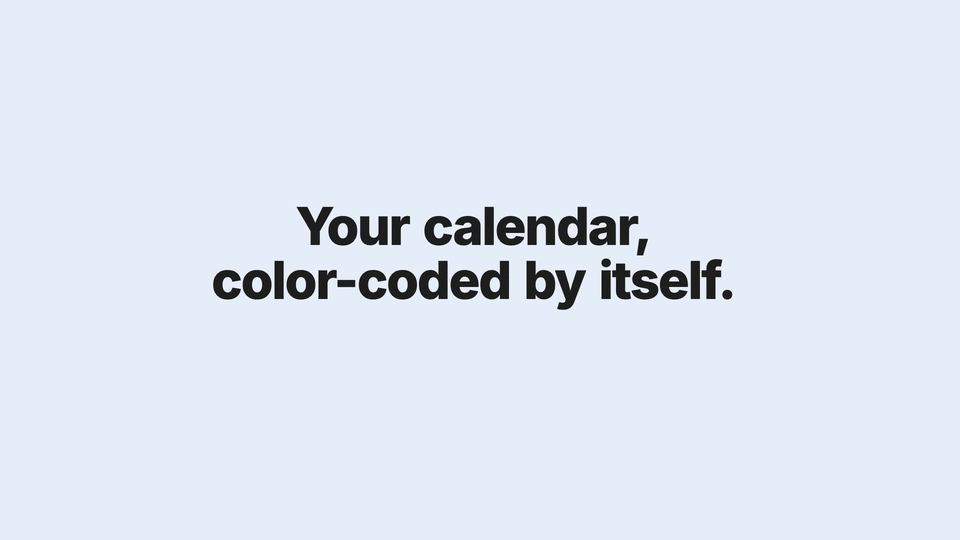
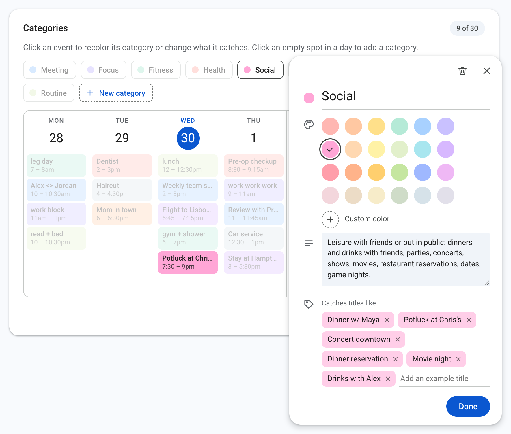
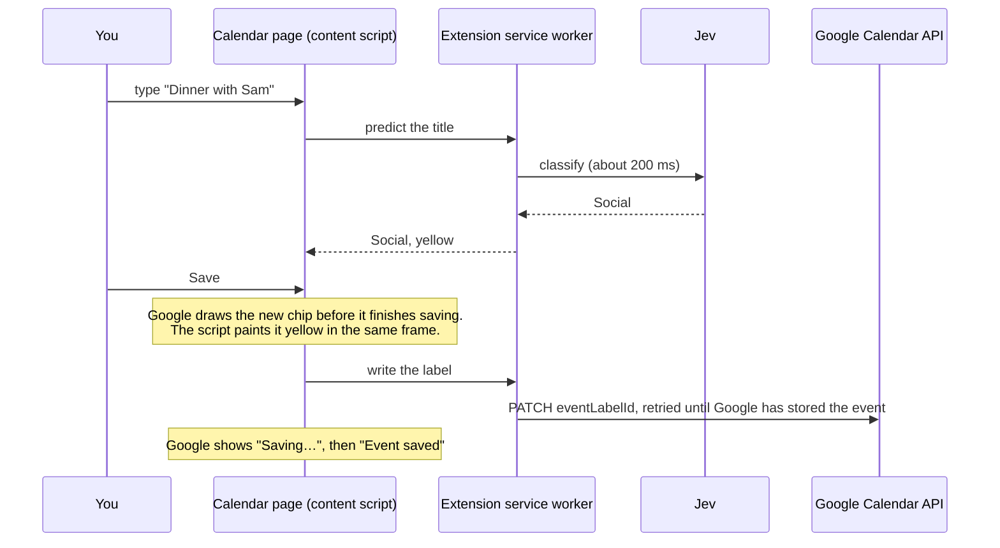

<p align="center">
  
</p>

<h1 align="center">Daybow</h1>

<p align="center">
  <strong>Every Google Calendar event, color-coded by category as you create it.</strong>
</p>

<p align="center">
  <a href="https://github.com/karthikvetrivel/Daybow/actions/workflows/ci.yml"></a>
  <a href="LICENSE"></a>
  
  
  <a href="CONTRIBUTING.md"></a>
  <a href="https://github.com/karthikvetrivel/Daybow/stargazers"></a>
</p>

<p align="center">
  <a href="#install">Install</a> ·
  <a href="#how-the-instant-color-works">How it works</a> ·
  <a href="#edit-categories-on-a-calendar">Categories</a> ·
  <a href="#faq">FAQ</a> ·
  <a href="CONTRIBUTING.md">Contribute</a>
</p>

<p align="center">
  
</p>

Daybow is a Chrome extension that gives every event on your Google Calendar a category and a pastel color. [Jev](https://typesafe.ai) from TypeSafe picks the category from the title while you type it. The new event appears already colored, before Google even finishes saving it.

## Why Daybow

A color-coded week reads at a glance: meetings in blue, workouts in green, dinners in yellow. Google Calendar can show this, but you pick each color by hand, one event at a time. Keyword rules help only when a title contains the keyword. Daybow reads what a title means, so every new event gets its color with no clicks and no rules.

## Highlights

- **Colored as you create.** Daybow predicts the category while you type the title. The new event gets its color in the same frame that Google draws it.
- **Real Google Calendar labels.** Daybow writes labels through the Calendar API, so the colors show on your phone too.
- **Meaning, not keywords.** "Tapas with Priya" lands in Social and "Root canal" lands in Health, with no rules to write.
- **Your whole week at once.** The first run labels the past 7 days and the next 60 days, in a wave across the calendar.
- **Categories on a calendar.** You edit categories on a week that looks like Google Calendar, with 24 preset pastel colors.
- **Your choices stay.** A label that you set or remove by hand stays that way. Label edits made in Google Calendar are adopted.
- **Private and cheap.** Daybow runs in your browser and stores no event titles, except titles that you type. Labeling a real week of 64 events cost about half a cent.
- **Open source.** MIT license, strict TypeScript, and tests for the labeler, the painter, and the editor.

## Meaning, not keywords

Jev is a classification model from TypeSafe. While you type, it reads the title. During a sweep, it also reads the description, the location, the times, and the guests. None of these titles is an example in any category, and none needs a rule:

| Title | Jev's pick | Confidence |
|---|---|---|
| Tapas with Priya | Social | 0.99 |
| Root canal | Health | 1.00 |
| Pickleball with Sam | Fitness | 0.97 |
| Red-eye to Boston | Travel | 1.00 |
| Grandma turns 90 | Family | 1.00 |
| Oil change | Personal | 1.00 |
| Write Q3 plan | Focus | 1.00 |
| 1:1 with Dana | Meeting | 1.00 |
| Meal prep | Routine | 0.86 |

These are title-only predictions with the default categories, measured on September 26, 2026. Each call took about 200 ms.

## How Daybow compares

| | Color by hand | Keyword rules | Daybow |
|---|---|---|---|
| Setup | None | A rule for each keyword | Sign in with Google |
| Work for each new event | A few clicks | None | None |
| A title with no known keyword | You pick a color | No color | Jev picks a category |
| Color on your phone | Yes | Depends on the tool | Yes |
| When a new event gets its color | When you set it | When the rule runs | Before Google finishes saving |

## Edit categories on a calendar



The configuration page shows your categories as a week in Google Calendar's style. Each category appears as events titled with its example titles, so you can see what it catches.

- Click an event or a category pill to open its card. Pick one of 24 pastel colors or a custom color. The color saves at once, and with the extension, open Calendar tabs repaint in place.
- In the same card, rename the category, describe what belongs in it, and add or remove example titles. Jev reads all three.
- Click an empty spot in a day to add a category, the way you create an event.

## How the instant color works

Google Calendar's web page keeps its own copy of your events. It does not show a label that another client applied until you reload the page. The extension works around this in three steps.



1. While you type a title in Google's event dialog or full editor, the content script asks the service worker for the category. The worker answers from a cache of earlier titles, or with one Jev call on the title alone.
2. Google draws the saved event's chip before it finishes saving, with its final event id, and shows "Saving…" for about two seconds. The content script paints the chip in the frame where it appears.
3. The worker writes the label with the Calendar API. The write retries until Google has stored the event, and Google's "Event saved" toast wakes it so that it lands right away.

Measured in Chrome for Testing with the real extension, on a test page that uses Google Calendar's chip markup:

| Case | Time from chip to color |
|---|---|
| Title typed, then saved | 7 ms |
| A title seen before (cached) | 13 ms |
| Saved before the prediction arrived | 236 ms |

Events from your phone, from Gmail, or from another tab take a different path. While the Calendar tab is visible, the extension asks the Calendar API for changes every 20 seconds. It labels new events and repaints what changed. The optional web app labels those events on the server within seconds, through Google push notifications.

On a real week of 64 events, Jev labeled 61 with a confidence of 0.5 or more, in 2.4 seconds, for about half a cent.

## Install

### Download a release

Setup takes about two minutes. You need Chrome and a Jev API key from [console.typesafe.ai/keys](https://console.typesafe.ai/keys).

1. Download `daybow-0.1.0.zip` from the [latest release](https://github.com/karthikvetrivel/Daybow/releases/latest) and unzip it.
2. Open `chrome://extensions` and turn on "Developer mode".
3. Click "Load unpacked" and select the unzipped folder. The Daybow page opens.
4. Click "Sign in with Google". Google says that it has not verified the app. Click "Advanced", then "Go to Daybow".
5. Paste your Jev API key and click "Save key".

A Chrome Web Store listing is on its way. It replaces steps 1 to 3 with one click on "Add to Chrome".

### Build from source

Use this path to change the code or to use your own Google OAuth client. Setup takes about 10 minutes, most of it in the Google Cloud console.

You need Node.js 22 or later, Chrome, a Google OAuth client, and a Jev API key.

1. Clone the repository and install the packages.

   ```
   git clone https://github.com/karthikvetrivel/Daybow.git
   cd Daybow
   npm install
   ```

2. Follow [Set up Google sign-in](#set-up-google-sign-in) once.
3. Build the extension.

   ```
   npm run build:extension
   ```

   The build prints your extension id and a redirect URI. Add that redirect URI to your OAuth client.
4. Open `chrome://extensions` and turn on "Developer mode".
5. Click "Load unpacked" and select the `extension/dist` folder.
6. Click the extension's icon and click "Sign in with Google".
7. Paste your Jev API key from [console.typesafe.ai/keys](https://console.typesafe.ai/keys) and click "Save key".

The first run labels the past 7 days and the next 60 days. Open Google Calendar and create an event to see the instant color.

If you rebuild the extension, click the reload arrow on its card in `chrome://extensions`, then reload your Calendar tabs.

## Set up Google sign-in

The extension and the web app use your own Google OAuth client. You set it up once in the Google Cloud console.

1. Create a project at [console.cloud.google.com/projectcreate](https://console.cloud.google.com/projectcreate).
2. Enable the [Google Calendar API](https://console.cloud.google.com/apis/library/calendar-json.googleapis.com) for the project.
3. Open [Google Auth Platform](https://console.cloud.google.com/auth/overview) and click "Get started". Give the app a name, pick "External", and add your email.
4. Under "Data access", add the scopes `https://www.googleapis.com/auth/calendar.events` and `https://www.googleapis.com/auth/calendar.calendars`.
5. Under "Clients", create a client of type "Web application". Add these authorized redirect URIs:
   - `https://<your-extension-id>.chromiumapp.org/` for the extension. The build prints this address.
   - `http://localhost:3000/api/auth/callback` for the web app in development.
   - `https://<your-domain>/api/auth/callback` for the web app in production.
6. Download the client JSON, then store it in `.env.local`:

   ```
   scripts/set-google-client.sh ~/Downloads/client_secret_XXXX.json
   ```

7. Under "Audience", click "Publish app". In "Testing" status, Google expires the web app's sign-in after 7 days.

Until Google verifies the app, it shows an "unverified app" warning and allows 100 users. For your own use, click "Advanced", then "Go to" your app name. To remove the warning, submit the app for verification. Verification needs a domain that you own, the privacy page at `/privacy`, and a short video of the sign-in flow.

## Run the web app (optional)

The web app labels events on the server, so events that you create on your phone get labels too. It is a Next.js app that runs on Vercel.

[](https://vercel.com/new/clone?repository-url=https%3A%2F%2Fgithub.com%2Fkarthikvetrivel%2FDaybow&project-name=daybow&repository-name=daybow&env=GOOGLE_CLIENT_ID,GOOGLE_CLIENT_SECRET,TYPESAFE_API_KEY,APP_SECRET,CRON_SECRET,BASE_URL&envDescription=See%20the%20Configuration%20section%20of%20the%20README&envLink=https%3A%2F%2Fgithub.com%2Fkarthikvetrivel%2FDaybow%23configuration)

1. Deploy the repository to Vercel, or run `vercel link` and `npm run deploy` from your clone.
2. Set the variables listed in [Configuration](#configuration).
3. In the Vercel dashboard, create a Blob store and connect it to the project. This sets `BLOB_READ_WRITE_TOKEN`.
4. Add `https://<your-domain>/api/auth/callback` to your OAuth client.
5. Open your deployment and click "Sign in with Google".

After sign-in, the web app creates the categories on your calendar and labels your week. It watches your calendar through Google push notifications, and a daily sweep at 09:00 UTC catches anything missed. The status page lets you edit categories, label now, or disconnect and delete your data.

For local development, copy `.env.example` to `.env.local` and fill in the values. Then run `npm run dev` and open `http://localhost:3000`. Without a Blob token, the app stores its data in `.data/store.json`.

## Configuration

| Variable | Needed by | Meaning |
|---|---|---|
| `GOOGLE_CLIENT_ID` | extension build, web app | Your OAuth client id |
| `GOOGLE_CLIENT_SECRET` | web app | Your OAuth client secret |
| `TYPESAFE_API_KEY` | web app | Jev API key from TypeSafe |
| `APP_SECRET` | web app | 16 or more random characters. Encrypts refresh tokens and signs cookies. Create one with `openssl rand -base64 48`. |
| `CRON_SECRET` | web app | Protects the daily sweep. Vercel sends it to the cron route. |
| `BASE_URL` | web app, production | Public address of the deployment, for the redirect URI and push notifications |
| `BLOB_READ_WRITE_TOKEN` | web app | Vercel Blob storage |
| `UPSTASH_REDIS_REST_URL`, `UPSTASH_REDIS_REST_TOKEN` | web app | Redis storage, instead of Blob. `KV_REST_API_URL` and `KV_REST_API_TOKEN` also work. |
| `STORE_BACKEND` | web app | `file`, `blob`, or `redis`, to override the automatic choice |
| `LABEL_MIN_CONFIDENCE` | web app | Lowest Jev confidence that gets a label. Default 0.3. |
| `LABEL_WINDOW_PAST_DAYS`, `LABEL_WINDOW_FUTURE_DAYS` | web app | The date window that gets labels. Default 7 days back and 60 days ahead. |
| `JEV_MODEL` | web app | The Jev model. Default `jev-latest`. |
| `EMBED_JEV_KEY` | extension build | `1` embeds `TYPESAFE_API_KEY` as the extension's default key |

The extension keeps its own values on its configuration page: the Jev key, the minimum confidence, the sweep interval, and the date window.

Do not share an extension build made with `EMBED_JEV_KEY=1`, because it contains your Jev key.

## Development

```
npm test                  # unit, DOM, and flow tests. The live Jev test runs when TYPESAFE_API_KEY is set.
npm run typecheck         # the web app and the extension
npm run build:extension   # extension/dist
npm run package:extension # release/: a ZIP for GitHub Releases and one for the Chrome Web Store
npm run dev               # the web app on http://localhost:3000
npm run eval              # classify .data/real-events.json, an events.list export, and write .data/eval.md
```

These are the main folders:

| Folder | Contents |
|---|---|
| `lib/` | The labeler, shared by the extension and the web app: categories, Jev client, Calendar API client, label sync |
| `extension/` | The Chrome extension: service worker, content script with the painter, configuration page |
| `ui/` | The categories editor, shared by the extension and the web app |
| `app/` | The Next.js web app: sign-in, status page, webhook, daily sweep |
| `demo-video/` | The demo video, made in code with Remotion |

The painter in `extension/src/paint.ts` documents the parts of Google Calendar's page that it relies on. The tests in `tests/paint.test.ts` use chip markup copied from the live page.

## FAQ

<details>
<summary>Does it work on my phone?</summary>

Daybow writes real Google Calendar labels, so the colors show in the Google Calendar app on your phone. The instant color needs the extension in Chrome on a computer. An event that you create on your phone gets its label at the next check, every 20 seconds while a Calendar tab is open. With the optional web app, it gets its label within seconds.
</details>

<details>
<summary>What does Jev see, and what does it cost?</summary>

While you type, Jev sees only the title. A sweep sends each event's title, a short excerpt of the description, the location, the times, and attendee counts and domains. TypeSafe states a zero data retention policy for Jev. Labeling a real week of 64 events cost about half a cent.
</details>

<details>
<summary>Will my guests get emails?</summary>

No. Daybow changes only the label or color of an event, with `sendUpdates=none`. Titles, times, guests, and notifications stay as they are.
</details>

<details>
<summary>What if Daybow picks the wrong category?</summary>

Change the label in Google Calendar. Daybow keeps a label that you set by hand. To teach Jev, add the title as an example to the correct category in the categories editor.
</details>

<details>
<summary>Can I use my own categories?</summary>

Yes. You can have up to 30 categories, each with its own name, description, example titles, and color. Jev reads all of them when it picks a category.
</details>

<details>
<summary>Does it work with Google Workspace accounts?</summary>

Usually. If your organization's admin blocks third-party apps, sign-in shows an error, and the admin must allow the app. If an account cannot use named labels, Daybow uses Google's 11 classic event colors.
</details>

<details>
<summary>Why is Daybow not in the Chrome Web Store?</summary>

A listing is on its way. Until then, download the release ZIP and load it in Developer mode, as described in <a href="#install">Install</a>. It takes about two minutes.
</details>

## Privacy

- The extension keeps its data in your browser: a Google access token, your categories, and one decision per labeled event. Event titles are not stored, except the titles you typed, which the prediction cache keeps.
- The web app stores your email, an encrypted refresh token, your categories, and one decision per event. It does not store event titles.
- To pick a category, the labeler sends an event's title, a short description excerpt, the location, the times, and attendee counts and domains to Jev. While you type, only the title goes to Jev. TypeSafe states a zero data retention policy for Jev.
- Only the label or color of an event changes. Titles, times, guests, and notifications stay as they are. Updates use `sendUpdates=none`, so guests get no emails.
- "Sign out and forget my data" in the extension, and "Disconnect and delete my data" in the web app, remove everything that each one stored.

## Limits

- The instant color depends on Google Calendar's page structure and on the English "Event saved" toast. If Google changes the page, labels still land, and colors show after a reload.
- Only your primary calendar gets labels.
- Named labels use the Calendar API's `eventLabelVersion=1`. If an account cannot use them, the labeler falls back to Google's 11 classic event colors.
- Jev is in early access, and its rate limits can change. The clients retry with backoff.

## Roadmap

- A public Chrome Web Store listing, so that installs take one click.
- Labels on more than the primary calendar.
- Toast detection in more languages.
- A Firefox build.

## Contributing

Issues and pull requests are welcome. Read [CONTRIBUTING.md](CONTRIBUTING.md) first. To report a security problem, follow [SECURITY.md](SECURITY.md).

## Support Daybow

If Daybow makes your week easier to read, star the repository. Stars help other people find it.

<a href="https://star-history.com/#karthikvetrivel/Daybow&Date"></a>

## Credits

- [Jev](https://typesafe.ai) from TypeSafe picks the categories.
- [Remotion](https://www.remotion.dev) renders the demo video from code.

## License

[MIT](LICENSE)
